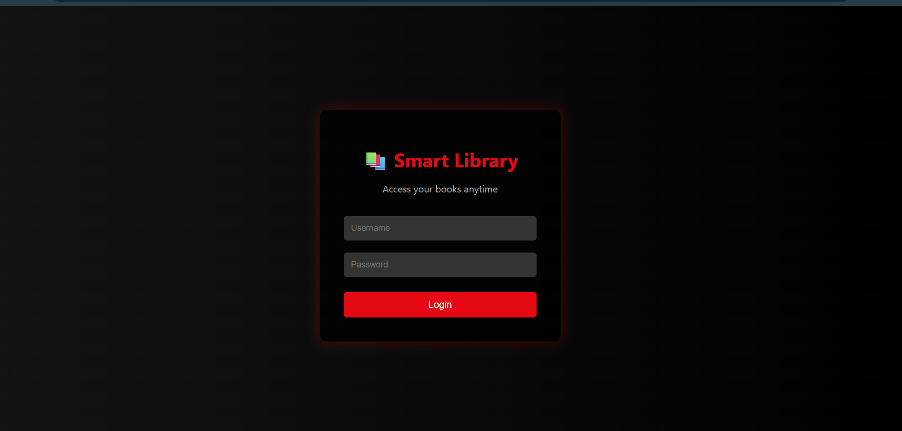
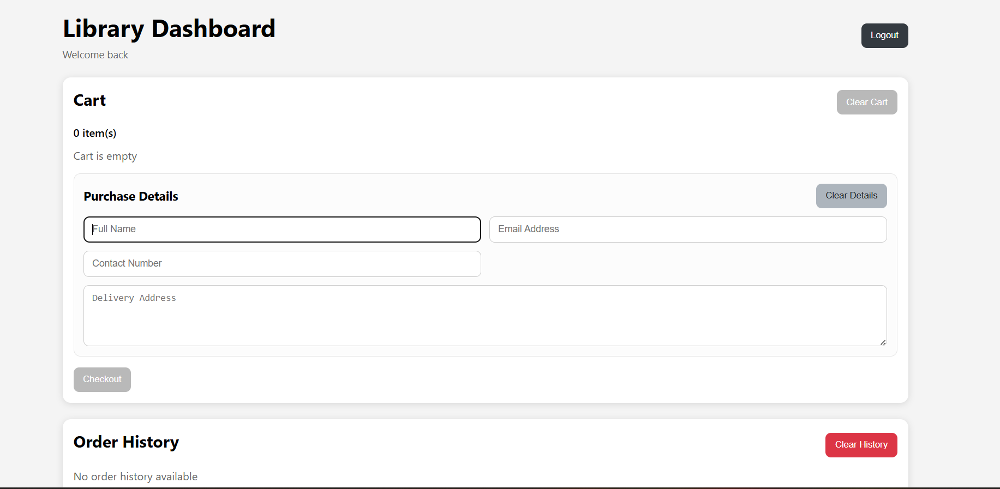
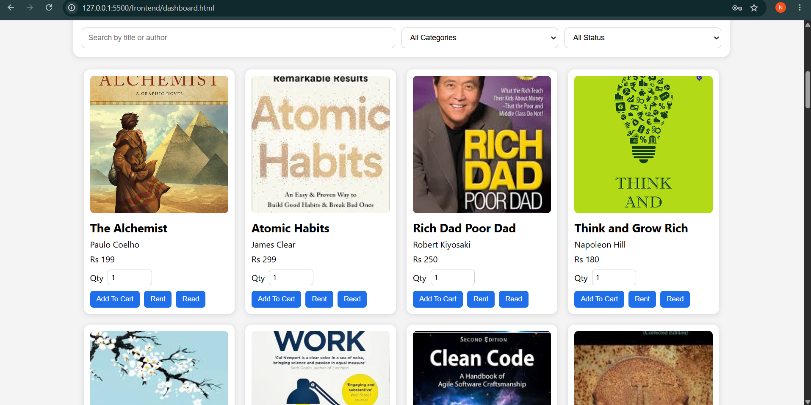
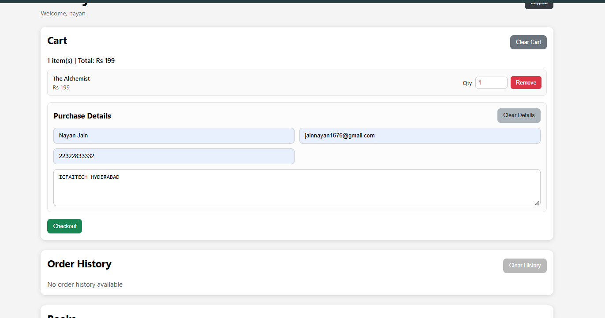
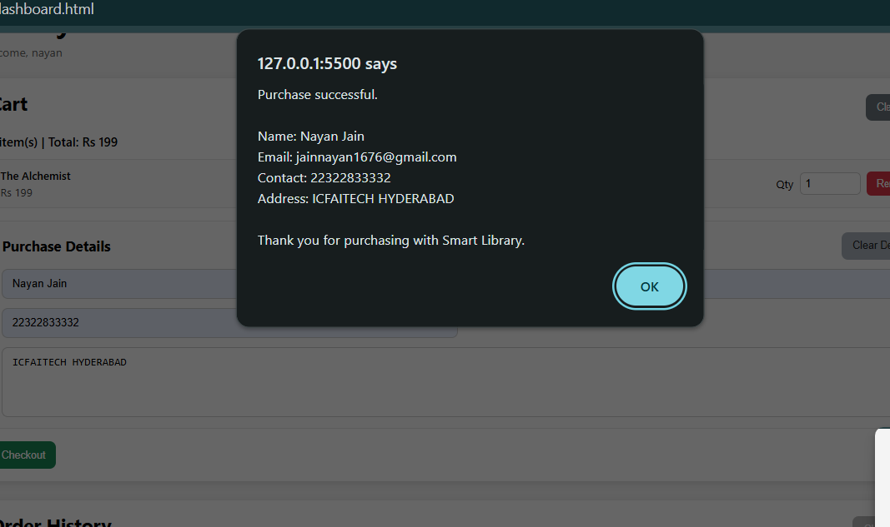
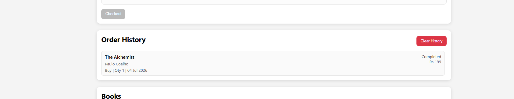

# 📚 Library Management System
A web-based **Library Management System** developed to simplify library operations such as managing books, users, issuing books, and returning books.
---
## 📖 Project Overview
The Library Management System is designed to help libraries maintain records efficiently. It provides an easy-to-use interface for managing books and users while reducing manual work.
---
## ✨ Features
- 📚 Add new books
- 📖 View available books
- 🔍 Search books
- 👨‍🎓 Manage users
- 📕 Issue books
- 📗 Return books
- 🗄 Database integration
- 💻 Simple and user-friendly interface
---
## 🛠 Technologies Used
### Frontend
- HTML5
- CSS3
- JavaScript
### Backend
- Python
### Database
- SQLite / MySQL
---
## 📂 Project Structure
```
library_management/
│
├── backend/
│
├── frontend/
│
├── .gitignore
│
├── LICENSE
│
└── README.md
```
---
## 🚀 Installation
### Clone the repository
```bash
git clone https://github.com/nayan1812/library_management.git
```
### Go into the project folder
```bash
cd library_management
```
### Install required packages
```bash
pip install -r requirements.txt
```
### Run the application
```bash
python app.py
```
---
## 🎯 Future Improvements
- User Authentication
- Admin Dashboard
- Barcode Scanner
- Fine Calculation
- Email Notifications
- Better UI Design
---
## 📷 Screenshots

### Home Page



---

### Dashboard


### 📚 Books Page



---

### 📖 More Books


---

### 🛒 Cart



---

### 💳 Checkout



---

### 📜 Order History



---

### 📄 Readable PDF


## 👨‍💻 Author
**Nayan Jain**
B.Tech Student | Aspiring Data Analyst & Machine Learning Enthusiast
GitHub:
https://github.com/nayan1812
---
## ⭐ Support
If you found this project useful, consider giving it a ⭐ on GitHub.
